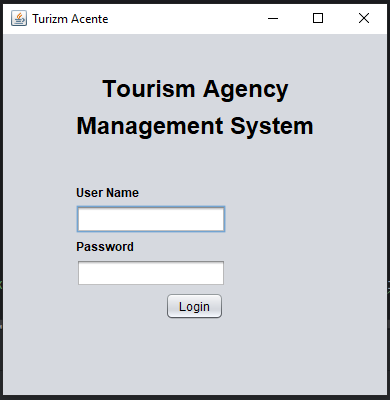
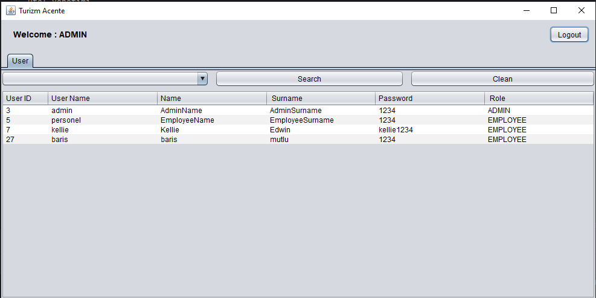
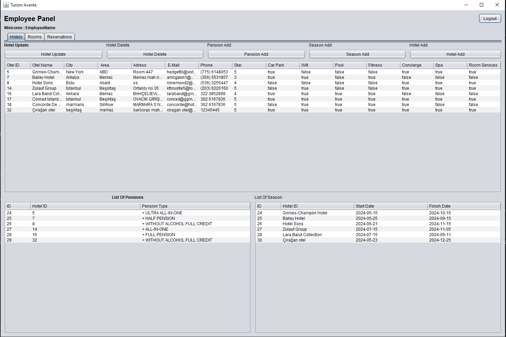
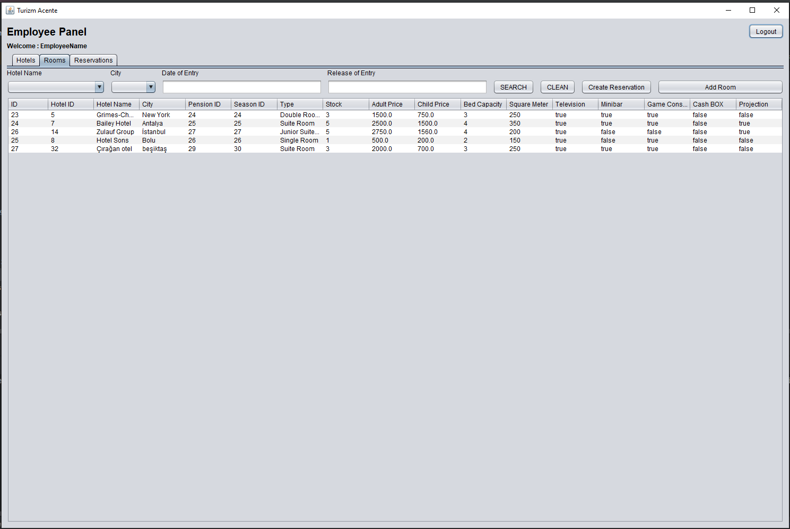
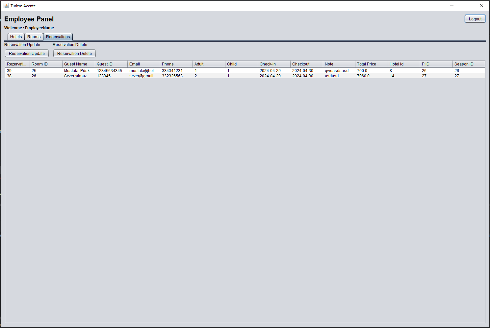

# Patika Turizm Acentesi Yazılımı

Bu proje, Patika Turizm Acentesi'nin günlük operasyonlarını dijitalleştirmek ve müşteri rezervasyon süreçlerini optimize etmek amacıyla geliştirilmiştir.
Video adresi:https://youtu.be/g5Dty7ybb8M
Not:Veri tabanı dosyası database klasöründedir.

## Özellikler

- Kullanıcı yönetimi (Admin ve Acente Çalışanı)
- Otel yönetimi
- Oda yönetimi
- Dönem yönetimi
- Fiyat yönetimi
- Oda arama
- Rezervasyon işlemleri

## Kullanılan Teknolojiler

- Veritabanı: MySQL
- Arayüz: JavaFX
- Dil: Java

## Kurulum

1. **Veritabanı Kurulumu:** `patika.sql` dosyasını MySQL veya PostgreSQL veritabanına içe aktarın.

2. **Proje İndirme:** Projeyi bilgisayarınıza indirin veya klonlayın:

    ```
    git clone <proje_git_url>
    ```

3. **Bağımlılıkların Yüklenmesi:** Projenin çalışması için gerekli bağımlılıkları yükleyin.

4. **Projeyi Çalıştırma:** Proje dosyalarını bir Java IDE'sinde açın ve çalıştırın.

## Kullanım

1. **Giriş Ekranı:** Proje başlatıldığında kullanıcı giriş ekranı görüntülenecektir.

2. **Admin Yetkilendirme:** Admin girişi yaparak kullanıcı yönetimi sekmesinden admin ve acente çalışanı ekleyebilir, düzenleyebilir ve silebilir.

3. **Acente Çalışanı Yetkilendirme:** Acente çalışanı girişi yaparak otel yönetimi, oda yönetimi, dönem yönetimi, fiyat yönetimi, oda arama ve rezervasyon işlemlerini gerçekleştirebilir.

4. **Otel Ekleme:** Acente çalışanı otel ekranından yeni otel ekleyebilir, var olan otelleri görüntüleyebilir ve silebilir.

5. **Oda Ekleme:** Acente çalışanı oda ekranından yeni oda ekleyebilir, var olan odaları görüntüleyebilir ve silebilir.

6. **Dönem Ekleme:** Acente çalışanı dönem ekranından yeni dönem ekleyebilir, var olan dönemleri görüntüleyebilir ve silebilir.

7. **Fiyat Ekleme:** Acente çalışanı fiyat ekranından yeni fiyat ekleyebilir, var olan fiyatları görüntüleyebilir .

8. **Oda Arama:** Acente çalışanı istediği tarih aralığına, şehre veya otel adına göre oda arayabilir.

9. **Rezervasyon İşlemleri:** Acente çalışanı rezervasyon ekranından rezervasyon ekleyebilir, var olan rezervasyonları görüntüleyebilir, düzenleyebilir ve silebilir.

## Ekran Görüntüleri

 

 

 

 

 

[](https://www.youtube.com/watch?v=g5Dty7ybb8M)


